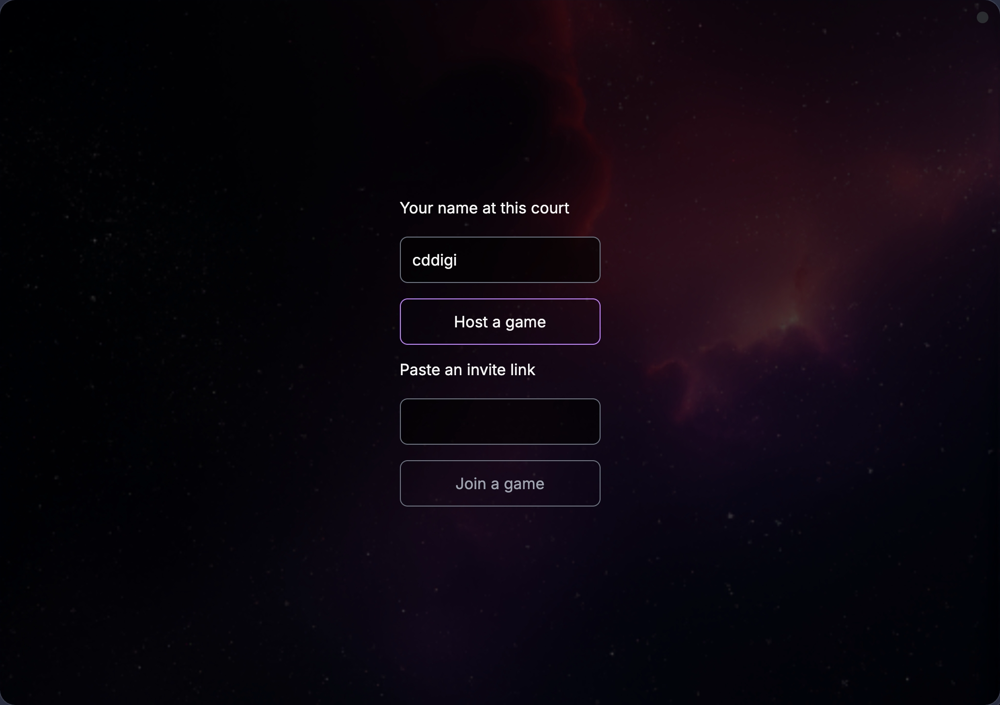
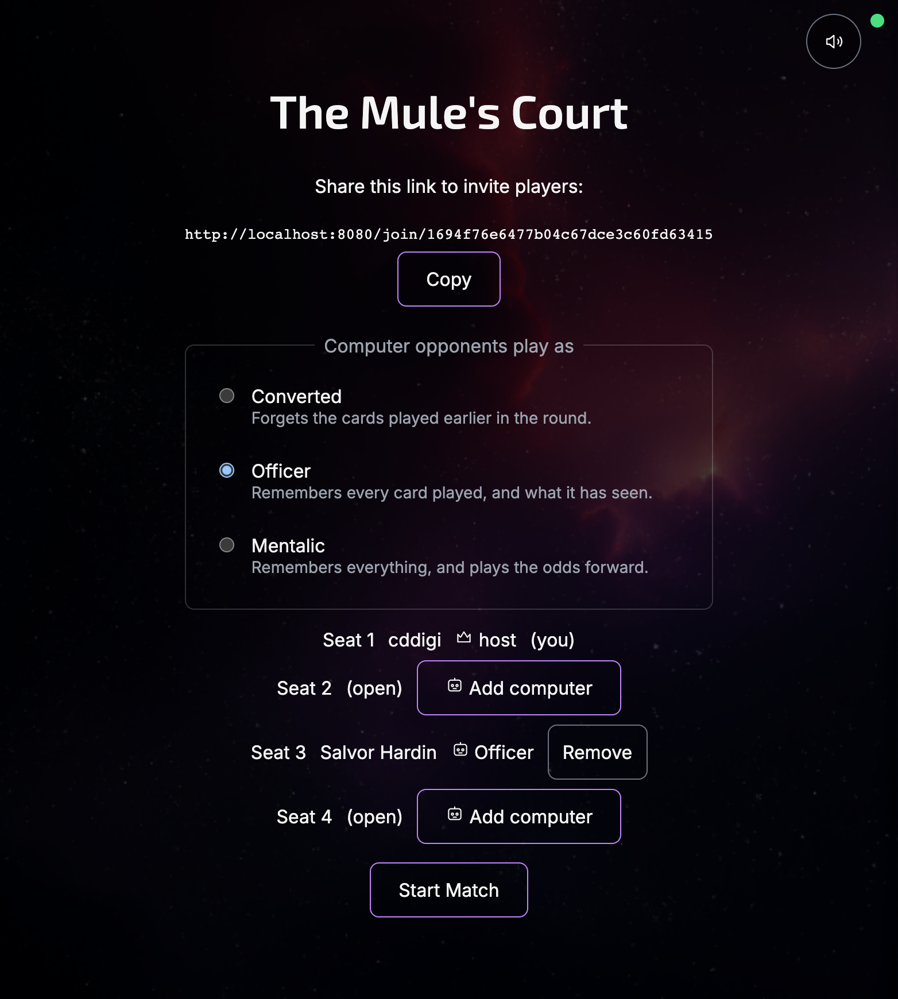
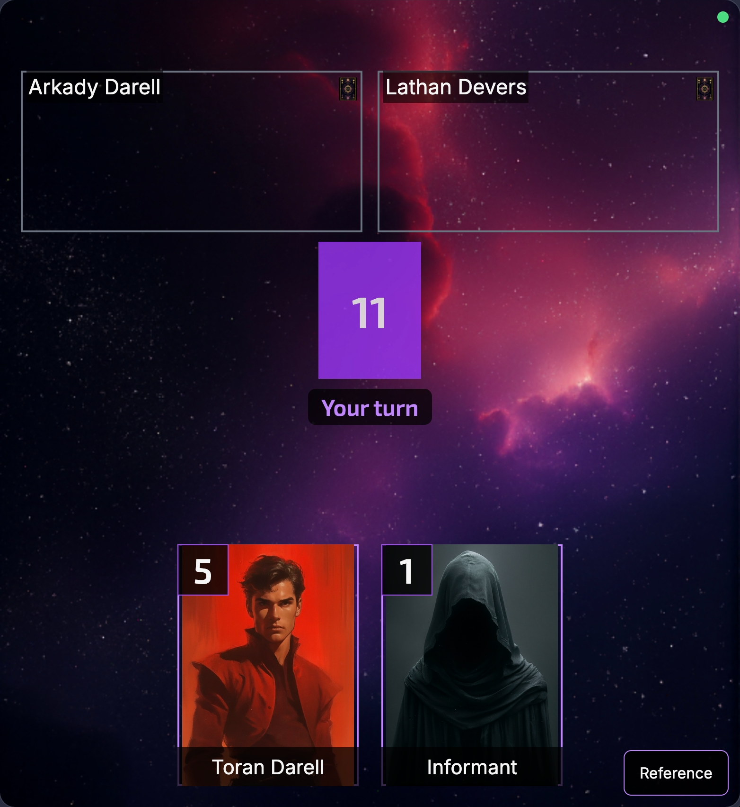
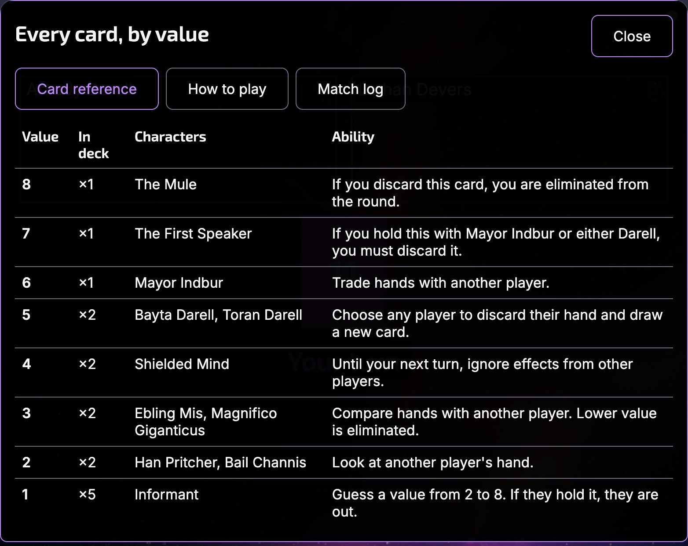
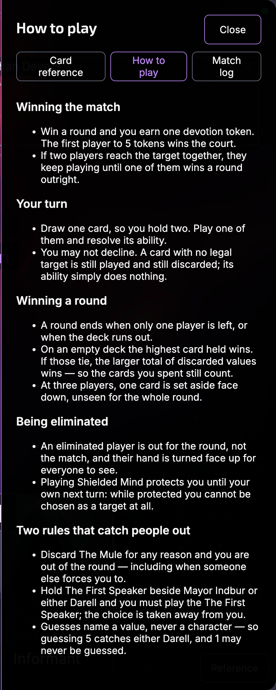

# The Mule's Court

**The Mule's Court** is a 2-4 player card game of deduction, risk, and elimination set in Isaac Asimov's Foundation universe. Inspired by Love Letter, this game explores the tragic irony of the Mule's mind control: every player believes they act independently, but all have been emotionally converted.

Play it in a browser, over the network, with 2-4 people. One player hosts, shares a
link, and the rest join from any device — phone, tablet, or desktop. Seats nobody takes
can be filled with [computer opponents](#computer-opponents), so it plays solo too.

## Play it

You need [Bun](https://bun.sh). Development takes two terminals, because the client
and the game server are separate processes:

```bash
bun install

bun run dev:server   # terminal 1 — :3000, the API and WebSocket half
bun run dev          # terminal 2 — :8080, the client
```

Open `http://localhost:8080`, click **Host a game**, pick a nickname, and share the
invite link the lobby shows you. Everyone who opens it lands on `/join/:matchId` and
takes a seat. Start the match when 2-4 people are seated.



_The opening screen. Name yourself, then either host a court or paste a link into
someone else's._



_The lobby. The invite link is the whole of joining. Any seat still open when you want
to begin can be filled by a computer opponent instead._

To play across a room instead of across tabs, use `bun run dev:host` in terminal 2 —
it binds to the network and prints an address other devices can open. See
[Playing from a phone](#playing-from-a-phone).

### Computer opponents

You do not need three other people. Any seat still open in the lobby can be filled with a
computer opponent, so the game plays solo — and a table can mix, two friends and one
machine. The controls belong to the host, and the difficulty is chosen per seat: the
picker sets what the *next* opponent is added at, so one court can hold a hard opponent
and two soft ones.

| Opponent      | In the code | What it does                                        |
| ------------- | ----------- | --------------------------------------------------- |
| **Converted** | `novice`    | Forgets the cards played earlier in the round.       |
| **Officer**   | `adept`     | Remembers every card played, and what it has seen.   |
| **Mentalic**  | `master`    | Remembers everything, and plays the odds forward.    |

All three run the same scorer on the same trained weights. What changes is how much of the
table a seat is allowed to remember, and whether it gets to search the futures its
uncertainty allows. That is the design rule and it is easy to get backwards: **an easy
opponent should reason well about less, not badly about everything.** One that throws away
a winning line reads as broken and teaches a new player nothing, while one that forgets a
discard from four turns ago and therefore guesses wrong reads as a person — and beating the
next tier up feels earned rather than granted.

**They cannot cheat, and not because they were told not to.** A policy is handed the same
`RedactedView` your browser receives, from the same call, so the deck, the set-aside card,
the seed and another player's hand have nowhere to reach it from. It cannot name a seat
either: the driver supplies the player id from whoever actually holds the turn, so a policy
cannot move for a seat it does not occupy. Both are missing capabilities rather than rules.

A computer seat waits 1.2 seconds before it plays. That is pacing, not thinking — deciding
takes well under a millisecond — because three seats resolving instantly is a table nobody
can read.

Filling a seat is one-way: the lobby has no button to empty it again, so a misclick means
starting a new court.

## Game Rules

### Objective

Be the first player to earn the required number of **Devotion Tokens**:

- **2 players**: 7 tokens to win
- **3 players**: 5 tokens to win
- **4 players**: 4 tokens to win

### Setup

1. Each player starts with 0 Devotion Tokens
2. Shuffle the 16-card deck
3. Remove cards from play:
   - **2 players**: Remove 3 cards (1 face-up, 2 face-down)
   - **3 players**: Remove 1 card face-down
   - **4 players**: No cards removed
4. Deal 1 card to each player

### Turn Structure

On your turn:

1. **Draw** a card from the deck (you now have 2 cards)
2. **Play** one of your two cards face-up
3. **Resolve** the card's ability (targeting other players)
4. **End** your turn (the played card goes to your discard pile)



_The table. Opponents across the top, the deck and its remaining count in the middle,
your two cards along the bottom. There is nowhere else to look._

Tapping a card opens its action sheet — the card's ability, the legal targets, and
nothing that is not a decision you have to make:


_Playing Toran Darell. It may be aimed at yourself, so all three seats are offered._

### Winning a Round

A round ends when:

- Only one player remains (others eliminated) → That player wins
- The deck runs out → Player with the highest card value wins

When the deck runs out, ties break on the **total value of the discard pile**. Players
still tied after that share the round, and each earns a token.

The round winner earns 1 Devotion Token. Reset the round and continue until a player
reaches the winning token count.


_Every discard pile turns face up when the round ends, so the deduction you were doing
all round can be checked against what was actually there._

### Sudden death

If two or more players reach the token target on the same round, no one has won yet.
The match enters **sudden death**: play continues, and the first player to win a round
outright takes the match. Token totals no longer decide it. A shared round in sudden
death settles nothing, and the tied players play on.

### Elimination

You are eliminated from the round if:

- Another player's card effect eliminates you
- You discard **The Mule** card (value 8)
- You must discard **The First Speaker** when holding Mayor Indbur or either Darell

A player who has played Shielded Mind cannot be chosen at all, and the interface says so
rather than letting you find out by trying:


_An Informant guess names a value, not a character — so the sheet spells out which card
the chosen number would actually catch._

## The Cards

The deck contains 16 cards representing characters from the Foundation series:

| Card                     | Value | Count | Ability                                                                                 |
| ------------------------ | ----- | ----- | --------------------------------------------------------------------------------------- |
| **Informant**            | 1     | 5     | Guess a value from 2 to 8. If a targeted player holds a card of that value, they are eliminated. |
| **Han Pritcher**         | 2     | 1     | Look at another player's hand.                                                          |
| **Bail Channis**         | 2     | 1     | Look at another player's hand.                                                          |
| **Ebling Mis**           | 3     | 1     | Compare hands with another player. Lower value is eliminated.                           |
| **Magnifico Giganticus** | 3     | 1     | Compare hands with another player. Lower value is eliminated.                           |
| **Shielded Mind**        | 4     | 2     | Until your next turn, ignore effects from other players.                                |
| **Bayta Darell**         | 5     | 1     | Choose any player to discard their hand and draw a new card.                            |
| **Toran Darell**         | 5     | 1     | Choose any player to discard their hand and draw a new card.                            |
| **Mayor Indbur**         | 6     | 1     | Trade hands with another player.                                                        |
| **The First Speaker**    | 7     | 1     | If you have this with Mayor Indbur or either Darell, you must discard this card.        |
| **The Mule**             | 8     | 1     | If you discard this card, you are eliminated from the round.                            |

Eleven named characters, sixteen physical cards. Three values are shared by two
different characters — Pritcher and Channis at 2, Mis and Magnifico at 3, the two
Darells at 5 — and each keeps its own name and portrait while resolving through the
same ability.

The same table is a keystroke away during a match, ordered the way you need it there —
by value, highest first, with the count still in the deck beside each row:



### Key Mechanics

- **Protection**: Playing Shielded Mind grants immunity until your next turn
- **Targeting**: You cannot target eliminated or protected players
- **The Mule**: Never willingly discard The Mule (value 8)—hold it to win if the deck runs out
- **The First Speaker**: Automatically discards if paired with specific high-value cards
- **Guessing is by value, not by name**: several values are shared by two characters, so guessing 5 catches either Darell. The Informant may never guess its own value of 1

### Reference without leaving the table

The **Reference** button in the corner of the table opens three tabs, and none of them
ends your turn. Beside the card reference above sit the rules and the log:



_**How to play** — the whole game in one scroll, including the two rules that catch
people out: discarding The Mule for any reason puts you out, and holding The First
Speaker beside a 5 or a 6 takes the choice away from you._


_**Match log** — every play, guess and consequence in order. It is the deduction game's
working memory, so nobody has to hold ten turns of public information in their head._

## Development

### Tech Stack

[Vite](https://github.com/vitejs/vite) 6 · [TypeScript](https://github.com/microsoft/TypeScript) 5.7 · [Bun](https://bun.sh) 1 (package manager, script runner, and the server's runtime)

No runtime dependencies. `package.json` declares none: the client is TypeScript and CSS, and the server is Bun's own APIs.

### Architecture

Four layers, each testable without the one above it:

| Layer                | Where               | What it is                                                                     |
| -------------------- | ------------------- | ------------------------------------------------------------------------------ |
| **Engine**           | `src/game/engine/`  | The rules, as pure functions. No I/O, no rendering, seeded RNG                 |
| **Server**           | `src/server/`       | `Bun.serve` WebSocket transport that wraps the engine and owns match state     |
| **Client (pure)**    | `src/client/`       | Layout, copy, palette, and state — no DOM, no ambient globals                 |
| **Client (surface)** | `src/client/ui/`    | The table and the chrome, one factory per DOM surface                        |

The interface holds no game state. The server pushes a `RedactedView` — one player's
redacted picture of the match — and the client sends back a single `PLAY_CARD` message.
Anything the interface appears to decide, it read from that view.

Rooms persist `{seed, actionLog}` rather than a state snapshot, and rebuild by replaying
actions through the engine. A server restart mid-match is therefore safe: clients
reconnect with backoff and resume their seat.

Beside those sits `src/game/ai/`, the [computer opponents](#computer-opponents). It is a
client of the engine rather than a layer of it: a policy takes the same `RedactedView` a
browser gets and returns a move, which is why it cannot read a deck or move for a seat it
does not hold. The scorer's weights are trained offline by the cross-entropy method
(`bun scripts/trainAi.ts`) and committed as `weights.generated.ts`, for the same reason
the embedded asset manifest is: `heuristic.ts` imports it, so a clone without it fails
`bunx tsc --noEmit`. `selfPlay.ts` and `arena.ts` are how a change to those numbers is
judged — by win rate over seeded matches, not by inspection.

The full design documents live in `docs/plans/` — engine architecture, transport
protocol, the UI/UX design, and `2026-07-30-computer-opponent-design.md` for the
opponents.

### Requirements

[Bun](https://bun.sh) is required to install dependencies and run scripts.

```bash
bun install
```

### Commands

**Development takes two processes.** The client creates rooms over `POST /api/rooms` and
plays the match over a WebSocket, so `bun run dev` on its own fails with `ECONNREFUSED` at
the first click of *Host a game*. Run both halves, in two terminals:

```bash
bun run dev:server   # :3000 — the API and WebSocket half
bun run dev          # :8080 — the client, proxying /api and /ws to :3000
```

Vite serves the client in development, so `dev:server` sets no `MULES_STATIC_ROOT` and
answers only `/api/rooms` and the socket upgrade. `bun run serve` is the production shape:
one process serving the built `dist/` as well.

| Command               | What it does                                                                        |
| --------------------- | ----------------------------------------------------------------------------------- |
| `bun run dev`         | Vite dev server for the client on `http://localhost:8080` (`vite/config.dev.mjs`)    |
| `bun run dev:server`  | The API and WebSocket server on `:3000`, under `bun --watch`                         |
| `bun run dev:host`    | Like `dev`, but bound to the network so another device can reach it                  |
| `bun run test`        | Every test — engine and client under Vitest, then server under `bun test`            |
| `bun run test:engine` | Engine and client tests only                                                         |
| `bun run test:server` | Server and transport tests only                                                      |
| `bun run test:watch`  | Vitest in watch mode                                                                 |
| `bun run build`       | Minified production build into `dist/` (`vite/config.prod.mjs`)                      |
| `bun run serve`       | Serve the built `dist/` and the game server from one process                         |

Type-check with `bunx tsc --noEmit`. Neither `vite build` nor the dev server checks types —
Vite transpiles without checking — so this is the only command that catches a type error.

**`dev:server` runs under `bun --watch`, and that matters.** Both halves import
`src/game/engine/`. Vite hot-reloads the client the moment an engine file changes, while an
unwatched server keeps running the engine it booted with; the two then disagree about the
shape of the data they exchange, and the symptoms look nothing like a version skew. `--watch`
means it never has to be diagnosed.

#### Playing from a phone

`bun run dev:host` binds Vite to the network and prints the address to open. Only Vite needs
it — the backend stays on `localhost`, because the proxy reaches it from the development
machine rather than from the device. The invite link the lobby shows is built from
`location.origin`, so it points at the address the device is actually using and can be handed
to a second device.

Anything served over a bare LAN address is a **non-secure context**, where `crypto.randomUUID`
and `navigator.clipboard` do not exist. Both are guarded — `src/client/store/ids.ts` and
`src/client/ui/clipboard.ts` prefer the real API and fall back — so hosting, joining, and the
lobby's **Copy** button all work on a phone.

### Testing

```bash
bun run test         # everything
bunx tsc --noEmit    # types
bun run build        # the production bundle still builds
```

Two runners, split by what each layer needs. Engine and client tests run under
**Vitest**; server and transport tests run under **Bun's own test runner**, because
Vitest's workers run under Node, which can load neither `bun:sqlite` nor the Bun
globals the transport depends on.

There is no linter configured.

Three gates fail for reasons worth knowing in advance:

- **`src/client/__tests__/purity.test.ts`** — `layout/`, `content/`, `store/`, and
  `tokens/` may not touch a DOM global or import server runtime. It reads raw file
  text, so a *comment* naming a banned global fails too.
- **`src/client/__tests__/axe.test.ts`** — axe-core over every DOM surface.
  `color-contrast` is the only disabled rule, because jsdom has no layout; contrast is
  checked arithmetically in `src/client/tokens/contrast.test.ts` instead.
- **`src/client/layout/discardCapacity.test.ts`** — drives thousands of real matches
  through the engine to prove the layout reserves room for the deepest discard pile
  that can actually occur (eight, not the seven the design assumed).

### Accessibility

The table is ordinary DOM, so it is reachable without a parallel accessibility
tree: seat chips and hand cards are real `<button>`s with accessible names, and a
card a rule forbids carries `aria-disabled` with the reason wired up by
`aria-describedby`. Announcements go to a separate toast channel rather than a
live region, so re-rendering a snapshot does not read every seat aloud again.

Phone-landscape is in scope, so **nothing depends on hover**. Every surface —
the table included — is covered by axe-core, and the palette is checked against
WCAG contrast ratios arithmetically.

Screen-reader gesture navigation on real hardware is the one thing the test suite
cannot assert — see [Status](#status).

### Project Structure

| Path                | Description                                                                    |
| ------------------- | ------------------------------------------------------------------------------ |
| `index.html`        | Root HTML entry point: the table container and the chrome layer above it      |
| `public/`           | Static assets copied as-is to the `dist` root at build time                    |
| `public/assets/`    | Game art and media (character portraits, cards, UI panels, shaders)            |
| `src/main.ts`       | Composition root — wires store, socket, and every surface together            |
| `src/game/engine/`  | The rules as pure functions — setup, legality, effects, round flow, redaction  |
| `src/game/ai/`      | The computer opponents: policies, trained weights, self-play and arena harness |
| `src/server/`       | The WebSocket transport: rooms, seats, dispatch, persistence, rate limiting    |
| `src/client/`       | Browser-independent client: `layout/`, `content/`, `store/`, `tokens/`         |
| `src/client/ui/`    | One factory per surface with `mount`/`update`/`destroy`; `table.ts` draws the table, `beats.ts` animates it |
| `src/client/styles/`| Self-hosted fonts, the authoritative palette, and the shell and table CSS      |
| `docs/plans/`       | Design documents and implementation plans for each layer                       |

### Assets

Portrait art lives under `public/assets/<character-slug>/` — one directory per card (`bail-channis/`, `bayta-darell/`, `ebling-mis/`, `first-speaker/`, `han-pritcher/`, `informant/`, `magnifico/`, `mayor-indbur/`, `mule/`, `shielded-mind/`, `toran-darell/`). The card back, the two effect textures and the playfield background live in their own top-level `public/assets/` folders.

Four thematic variants exist for every character, but **only the one the game
uses ships**. Vite copies `public/` into the bundle verbatim, so the three
unchosen variants live under `art/portraits/<character-slug>/` — tracked in the
repository, never built. That keeps roughly 13 MB of unused art out of every
player's download while leaving the curation pass (*UIX §12*) free to make a
different choice later. `src/client/content/portraits.ts` names the current
choice and explains how to change it.

The slug does not always match the card's display name: Magnifico Giganticus is
`magnifico/`, and The First Speaker is `first-speaker/`.

- `public/assets/PORTRAIT_PROMPTS.md` documents the generation prompts and settings behind every portrait, and how each character's color scheme is meant to map onto its card definition.
- `VISUAL_SHOWCASE.md` (repo root) is the interface reference: seat states, the
  action panel, the quick reference, the palette. It carries no layout metrics —
  geometry is computed from the live viewport by `src/client/layout/` — and
  `docs/plans/2026-07-23-uix-design.md` is authoritative where the two disagree.

## Self-hosting

Build the client, then run one process that serves both it and the game server:

```bash
bun install
bun run build        # → dist/
bun run serve        # :3000, serving dist/ and the WebSocket
```

`serve` is `MULES_STATIC_ROOT=dist bun src/server/index.ts`. The static root defaults
to none, so hosting the client is an explicit opt-in — a server with no client to serve
is a valid configuration, and it is what every test uses.

The server writes `mules-court.sqlite` in its **working directory**, storing each room's
`{seed, actionLog}` so matches survive a restart. Start the process from a directory
where that file belongs.

Four environment variables configure a deployment. Everything else in
`src/server/config.ts` is a design constant — the reveal window is ten seconds on
every machine because the design says so.

| Variable                | Default                 | Notes                                            |
| ----------------------- | ----------------------- | ------------------------------------------------ |
| `MULES_PORT`            | `3000`                  | Also moves `MULES_PUBLIC_BASE_URL`'s default     |
| `MULES_PUBLIC_BASE_URL` | `http://localhost:3000` | Prefix for the `joinUrl` the API returns          |
| `MULES_DB_PATH`         | `mules-court.sqlite`    | Relative to the working directory                 |
| `MULES_STATIC_ROOT`     | none                    | Directory of built client files, or unset for none |

An unusable `MULES_PORT` refuses to start rather than falling back to 3000: a server
listening somewhere other than where it was told is worse than one that does not come
up. Behind a reverse proxy, set `MULES_PUBLIC_BASE_URL` to the public origin — though
the client builds invite links from `location.origin` regardless, so links work either
way.

The bundle is not a static site. Serving `dist/` alone gets you a menu that cannot
create a room.

### As a single binary

`bun build --compile` bundles the Bun runtime, the server and every client asset into
one executable that runs with nothing installed and no `dist/` beside it:

```bash
bun run compile              # → ./mules-court, ~72 MB
./mules-court                # http://localhost:3000
MULES_PORT=8080 ./mules-court
```

Cross-compile with `bun run compile:linux-x64`, `compile:linux-arm64`,
`compile:darwin-arm64`, `compile:darwin-x64` or `compile:windows-x64`; those land in
`dist-bin/`. The size is Bun's runtime rather than the game, and is unavoidable with
`--compile`: the entire client accounts for about 7.6 MB of it, and only 104 KB of
*that* is JavaScript and CSS — the rest is portrait art.

**It lists every address it can be reached on**, because it is reachable on all of
them: the server is given no bind hostname, so it listens on every interface from the
moment it starts. Hosting a game across the house needs no flag and no environment
variable — only the right address:

```
  The Mule's Court

  Playing at   http://localhost:3000       this machine
               http://192.168.1.24:3000    en0
               http://100.101.102.103:3000 tailscale
  Database     /Users/you/mules-court.sqlite
  Assets       27 files compiled in

  Other devices can use any address below the first. Open that same
  one here too, before you invite anyone — the invite link is built
  from your browser's address bar, so a link copied from localhost
  works only on this machine.
```

Loopback comes first and is always offered. Every other line is an external IPv4
address, labelled with the interface carrying it — and a Tailscale address is named
rather than shown as the `utun` tunnel it rides on, so a machine on a LAN and a tailnet
at once presents three legible choices. Link-local addresses and IPv6 are left out: a
laptop can report a dozen of them and none is something a person types into a phone.

**Open the address you intend to share, on your own machine too.** The lobby builds its
invite link from `location.origin`, so a link copied from a `localhost` session sends
every guest back to their own machine. This is the one way to set the binary up wrong,
which is why the banner says so.

`bun run serve` prints no banner — it is the same server, and equally reachable, but the
addresses above are the binary's own startup output.

The binary still writes `mules-court.sqlite` to whatever directory it was launched
from — so a copy double-clicked out of a downloads folder keeps its matches there.
It prints the resolved path at startup, and `MULES_DB_PATH` moves it.

An unsigned macOS binary is quarantined on download; open it once with right-click →
**Open**, or clear the flag with `xattr -d com.apple.quarantine mules-court`.

**Assets are compiled in from a generated manifest.** `bun run compile` rebuilds
`dist/`, regenerates `src/server/embeddedAssets.generated.ts` and then compiles — in
that order, because Bun resolves `with { type: 'file' }` imports at bundle time and
the manifest has to name each file as source. The generated file is committed
(`standalone.ts` imports it, so a clone without it fails `bunx tsc --noEmit`), and its
content-hashed chunk names change whenever the client is rebuilt. Regenerate it rather
than editing it.

## Status

Version 1.2.0. The engine, the transport, the client, the computer opponents and
the MCP seat server are built and tested — 1,962 tests across 116 files — and a
match is playable end to end, alone or with up to three other people, from a
checkout or from a single-file binary you compile yourself.

Known limitations:

- **The real-device QA pass has not been run.** `docs/plans/2026-07-24-uix-qa-checklist.md`
  covers iOS Safari viewport behaviour and VoiceOver/TalkBack gesture navigation, neither
  of which an emulator or a test suite reproduces. The client is ready for the pass; it
  needs hardware and a person.
- **Binaries are unsigned.** macOS quarantines them on download; see
  [As a single binary](#as-a-single-binary). Nothing builds them on a tag, either — the
  `compile:*` scripts are run by hand.
- **A non-host cannot end a match whose host vanished mid-round.**

### License

This project's code is released into the public domain under [The Unlicense](https://unlicense.org) — see [`UNLICENSE`](UNLICENSE).
